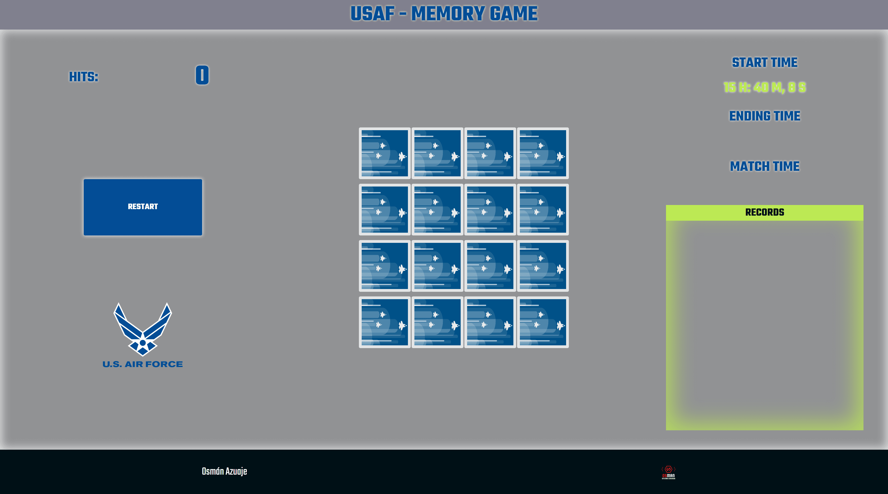

# MemoryGame

To simulate the famous card game called *MEMORY*, making use of the **DOM** modification using only **Javascript**.

## Characteristics:

1. Button with the text *"Start game"*, which finds out the current date and time of the computer to take it as the start time of the game. The amount of time you have been playing is displayed on the page. The button text changes to *"Restart Game".*

2. When starting the game, the cards are dealt randomly, so that, in each game, the cards are not in the same place.

3. When a user clicks on a face down card and then clicks on another face down card, if the second card is the same as the first, a success message is displayed and a counter is increased. If the user clicks again on a card that belongs to a pair that has already been found, the program should not do anything. If the second flipped card is not the same as the first, an error message should be displayed and both cards should be flipped face down again.

4. When the user gets all the pairs, he must show a message with the text *"You won"* and stop the timer. You must look in the **local storage** if there is any stored time, if there is a stored time, you must compare that stored time with the current game time. If the current game time is less than the stored time, a message is displayed to the user informing that the record has been broken and the stored time value must be updated with the current time value, otherwise the record is kept.

5. Any time the user clicks the *"Restart Game"* button, all cards must be flipped over, the game time and cards found counter must be reset, as well as the *"Start Game"* text placed back on the button.
